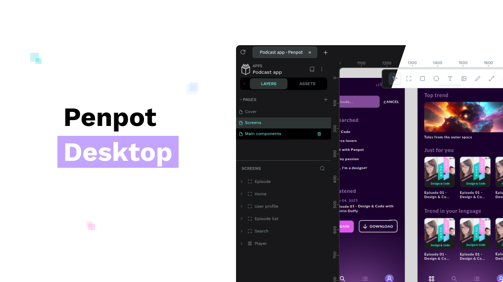

# Penpot Desktop

Penpot Desktop is an unofficial desktop application for the open-source design tool, Penpot.

It provides you with access to the functionality of the browser version of Penpot with an experience of a desktop application. It comes with

- system-level application experience e.g. a dedicated window, file extension association,
- versatile dark-light mode setup,
- tab interface for easy navigation between projects,
- ability to connect to different instances e.g. officially hosted, local for offline work,
- local instance creator, based on the official Docker setup,
- batch export of projects,
- and more are coming.

📡 Penpot Desktop loads the Penpot web application like a browser does. For offline use, the built-in [local instance creator](https://github.com/author-more/penpot-desktop/wiki/Self%E2%80%90hosting#instance-creator) can set up and run a local Penpot instance via Docker (per the official self‑hosting guide).

## Quick Links

- [Penpot](https://penpot.app/) - The official website for Penpot.
- [Documentation](https://github.com/author-more/penpot-desktop/wiki) - The Penpot Desktop knowledge base
  - [Installation instruction](https://github.com/author-more/penpot-desktop/wiki/Installation)
  - [Offline-use guide](https://github.com/author-more/penpot-desktop/wiki/Self%E2%80%90hosting)

## Development and Building

1. Ensure the environment meets the following requirements:
   - Supported OS:
     - Windows
     - macOS
     - Linux
   - [NodeJS](https://nodejs.org/)
   - [Git](https://git-scm.com/) (optional)

   For the detailed list of requirements, see the [prerequisites in Electron documentation](https://www.electronjs.org/docs/latest/tutorial/tutorial-prerequisites).

1. Clone the repository or download the source code.
1. Navigate to the project's directory.
1. Run `npm ci` to install packages.
   _Other package managers such as Yarn, PNPM, or Bun should work as well._
1. (Optional) Run `npm run setup` to prepare development environment.
1. (Optional) Run `npm run dev` to start the application in development mode. This will open a new window with the application running.

   > Note: Penpot Desktop is using ES Modules. Make sure to read the [ES Modules (ESM) in Electron guide](https://www.electronjs.org/docs/latest/tutorial/esm).

1. Run `npm run build` to build the application. By default, it will build for the current OS and architecture, but you can pass flags to build for other platforms. See the [Electron Builder documentation](https://www.electron.build/cli) for more information.
